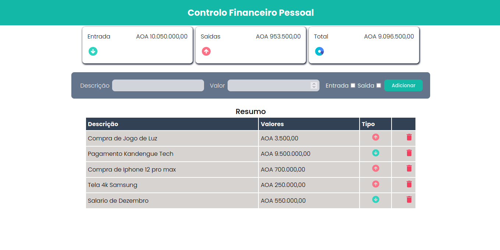

# SISTEMA DE FINANÇA PESSOAL
Sistema de finança pessoal, que permiter o usuário fazer a gestão dos seus gastos diarios!

## Introdução
Esse projecto foi criado com objectivo aprimorar o meu aprendizado
### Editor de Texto
VS CODE

### Pré-requisito
-Para instalar o projecto 
Passo -
    - comando para instalar o projecto na maquina local
```bash
npm install
```
Passo -2
 comando para rodar o projecto
``` bash
npm run dev
```

## Teclonogias usadas
### Teclonogias usadas front end
*[ReactJS](https://react.dev/)
*[Vite](https://vitejs.dev/)
*[Axios](https://axios-http.com/docs/intro)
### Teclonogias usadas No back End
*[Express](https://expressjs.com/)
*[Cors](https://developer.mozilla.org/pt-BR/docs/Web/HTTP/CORS)
*[nodemon](https://nodemon.io/)
*[mongoose](https://mongoosejs.com/)
